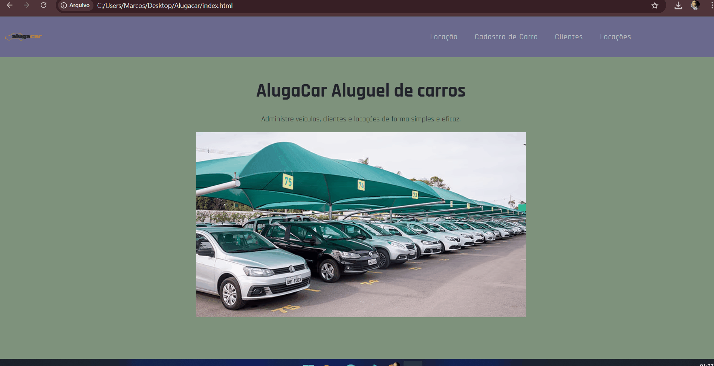

# Locadora de Veículos (Frontend)

📌Este é um protótipo de sistema para gerenciamento de uma locadora de veículos. Desenvolvido com HTML, CSS (Bootstrap) e JavaScript para interface web responsiva.

## Funcionalidades✅
- ✔️Cadastro de veículos
- ✔️Controle de clientes
- ✔️Controle de locações
- ✔️Navegação responsiva

[]

## Estrutura🧩
- `index.html` - Tela inicial🧩
- `locacao.html` - Locação de veículos🧩
- `cadastro-carro.html` - Cadastro de veículos🧩
- `clientes.html` - CRUD de clientes🧩
- `locacoes.html` - CRUD de locações🧩

